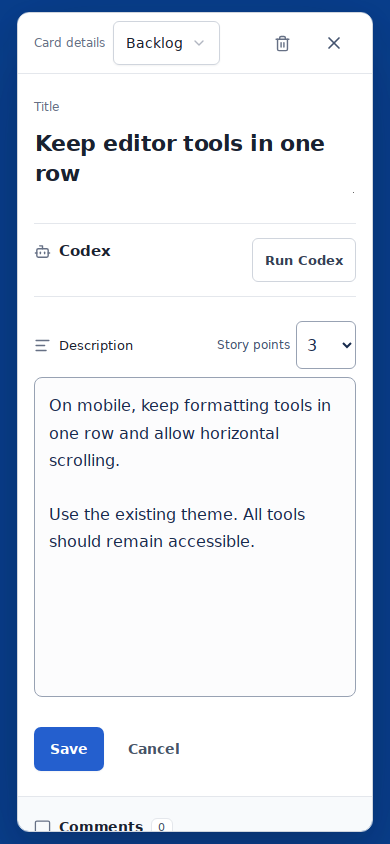
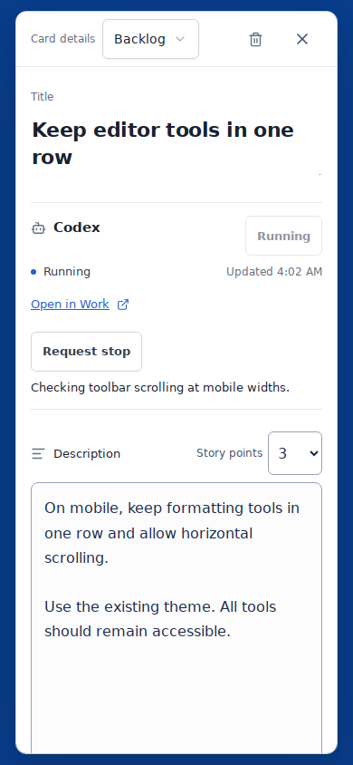
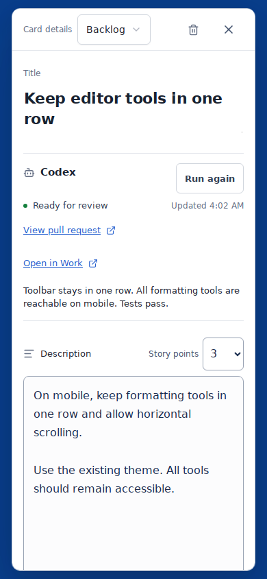
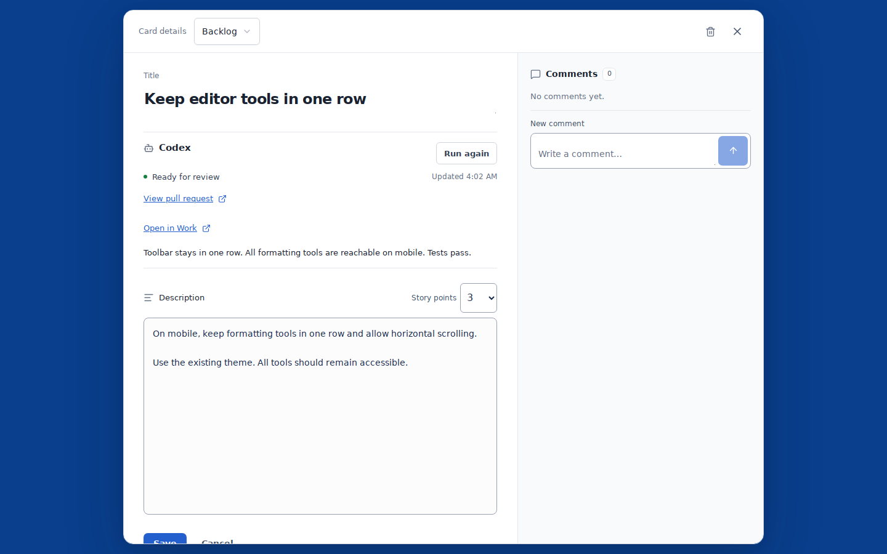
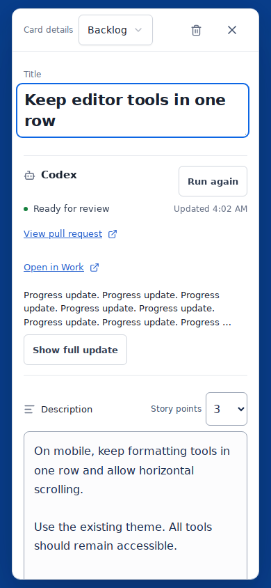
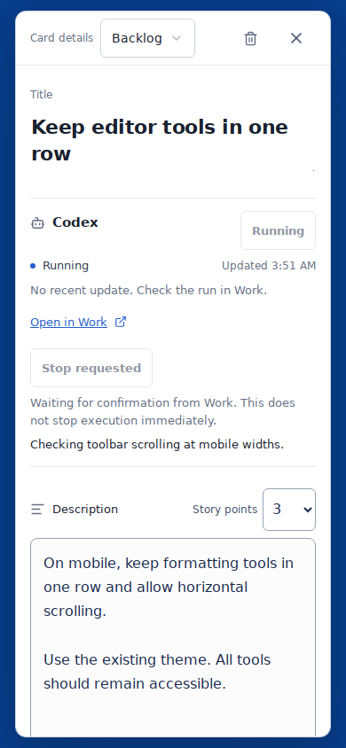

# Codex ticket panel

Screenshots use the real ticket dialog in Storybook with synthetic MCP status data.
They demonstrate the UI; no real Work run was launched. The result's PR link is
illustrative. Capture size: 390 × 844 for mobile and 1440 × 900 for desktop.

| Ready | Running | Result |
| --- | --- | --- |
|  |  |  |

Reproduce with `node scripts/verify-codex-preview.mjs` after `npm ci` and
`npx playwright install chromium`. The script starts its own Storybook process,
checks 320px and 390px layouts and 44px mobile controls, queues work, checks the
unsaved-ticket guard, unavailable connection, blocked/stale states, request failure
and retry, and validates the PR link. It then writes these screenshots.

Local validation: typecheck, lint, all 121 unit tests, production build, and the
Playwright preview checks passed. Browser capture used Chromium 134 available in
the execution environment. The Firestore emulator is not installed locally;
`emulator/ticket-runs.test.ts` runs in the PR's CI job. A real MCP subscription and
Work execution remain the separate integration's activation check.

Audit fixes add two mobile previews:

| Long result, collapsed | Stop request awaiting Work |
| --- | --- |
|  |  |

The browser verifier runs in CI and also checks remote-edit blocking, safe stop-request behavior,
and compact/expanded long updates. Work URLs and run data in these isolated
previews are illustrative; no real execution or cancellation occurs.
